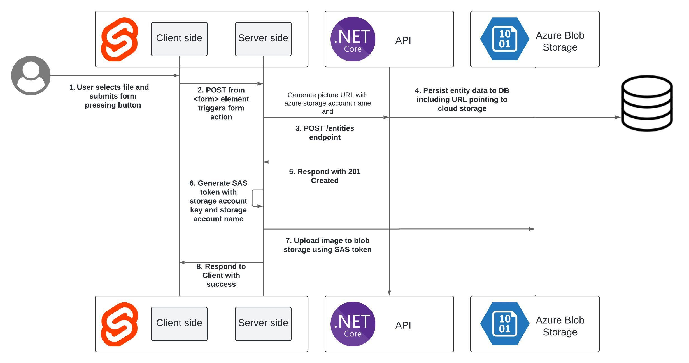

Working on the creation of recipes in [cook-web](https://github.com/luz-ojeda/cook-web) I implemented the upload of their images to Azure Blob Storage.

The general diagram of the actual process in my application is as follows (I will use the numbers of each part for reference later):



For illustrative purposes I am going to try to abstract as much as possible from the specifics of my particular case.

Versions:

-   [Svelte](https://www.npmjs.com/package/svelte) 4.2.7
-   [SvelteKit](https://www.npmjs.com/package/@sveltejs/kit) 2.0.0
-   [Vite](https://www.npmjs.com/package/vite) 5.0.3
-   [Azure Storage Blob client library for JavaScript](https://www.npmjs.com/package/@azure/storage-blob#azure-storage-blob-client-library-for-javascript) 12.17.0
-   Typescript 5.0.0

---

## 1 SvelteKit client
The SvelteKit client side is relatively simple, in a page `+page.svelte` we place:

```html
<script lang="ts">
    let files: FileList | null;
    let fileInput: HTMLInputElement;
</script>
```

```html
<form method="POST" enctype="multipart/form-data">
    <!-- Accept attribute value is an example, use whatever value you desire -->
    <input 
	accept="image/png, image/jpg" 
	bind:files 
	id="myFile" 
	name="myFile" 
	type="file" 
	/>
	<input 
	name="name" 
	type="text" 
	/>
    <button type="submit">Subir archivo</button>
</form>
```

Something important to note is the value of the `enctype` attribute on the `form` element. It is necessary because if you use [`use:enhance`](https://kit.svelte.dev/docs/form-actions#progressive-enhancement) as described in this [issue](https://github.com/sveltejs/kit/issues9819). If not, when you press the submit button, this console error occurs and the POST action is not executed:


For ilustrative purposes I didn't set `use:enhance` there but since I did in my repository I thought it was worth mentioning, took me a few minutes to open the console to figure out why nothing was happening when I was trying to submit the form.

## 2 - 4 SvelteKit Client -> SvelteKit Server
In the same path of `+page.svelte` we must have a `+page.server.ts` file that exports an *action*, which will be triggered when the form is submitted ([docs](https://kit.svelte.dev/docs/form-actions)). The file can export more than one action, besides the one exported by default (these additional are the *named actions* mentioned in the docs). In this case we only need the default one.

```typescript
export const actions = {
	default: async ({ request }) => {
		const data = await request.formData();

		const fileToUpload = data.get('myFile') as File;
		// data.get('') returns a value of type FormDataEntryValue which
		// it is a union of File and string so we can make an assert
		// a File with the keyword as

		const entityName = data.get('name');

		// Creation of the entity through the API in the DB
		const body = {
			name: entityName,
			files: [`https://${AZURE_STORAGE_ACCOUNT_NAME}.blob.core.windows.net/${name}`]
		};

		const response = await fetch(`${env.API_URL}`, {
			method: 'POST',
			headers: {
				'Content-Type': 'application/json',
			},
			body: JSON.stringify(body)
		});

		...
	}
} satisfies Actions;
```
The file is obtained calling [`FormData.get`](https://developer.mozilla.org/en-US/docs/Web/API/FormData). We then put together the request body to send to our API and use `fetch` to execute it.

The `files` property in the body of the request allows us, in a front end that consumes the API data, to know which URL corresponds to the entity's image (a user, a post, a cooking recipe, etc.).

## 5-7 SvelteKit Server -> Azure Storage
Still in the `default` action of `+page.server.ts`, if the API response is successful (status code 201), we proceed with uploading the file to Azure:

```typescript
	...
	if (response.status === 201) {
		const responseJson = await response.json();

		if (fileToUpload !== null) {
			await uploadFile(fileToUpload, entityName);
		}
		return { success: true, data: responseJson };
	}
	return fail(response.status);
	...
```

For the upload we will need two elements:
1. A [SAS shared access signature](https://learn.microsoft.com/en-us/azure/storage/common/storage-sas-overview) (a.k.a. SAS token): Provides delegated access to resources on a certain time window, with limited permissions, etc.
2. The Azure storage account [access key](https://learn.microsoft.com/es-es/azure/storage/common/storage-account-keys-manage)

Both elements should not be exposed to the client for security reasons and that is, in part, why we perform this process on SvelteKit server side.

For SAS shared access signing we first need to install the package [@azure/storage-blob](https://www.npmjs.com/package/@azure/storage-blob):

```bash
npm install @azure/storage-blob
```
With the following function we create the signature:

```typescript
import {
	generateAccountSASQueryParameters,
	StorageSharedKeyCredential,
	AccountSASServices,
	AccountSASResourceTypes,
	AccountSASPermissions,
	SASProtocol,
	BlobServiceClient
} from '@azure/storage-blob';

...

function createSasToken() {
	const sasOptions = {
		services: AccountSASServices.parse('b').toString(),
		resourceTypes: AccountSASResourceTypes.parse('co').toString(),
		permissions: AccountSASPermissions.parse('w'),
		protocol: SASProtocol.Https,
		expiresOn: new Date(new Date().valueOf() + 3 * 60 * 1000) // 3 minutos
	};

	const constants = {
		accountName: env.AZURE_STORAGE_ACCOUNT_NAME,
		accountKey: env.AZURE_STORAGE_ACCOUNT_KEY
	};

	const sharedKeyCredential = new StorageSharedKeyCredential(
		constants.accountName,
		constants.accountKey
	);

	return generateAccountSASQueryParameters(sasOptions, sharedKeyCredential).toString();
}
```
In `sasOptions` we set the token properties:
- Permission to access containers and objects ('bo') of the Blob service ('b')
- Write permission ('w')
- Can only be access resources via HTTPS
- Expires after 3 minutes

Next to the name of the storage account and its key we can generate the signature with `generateAccountSASQueryParameters`. I used [this material](https://learn.microsoft.com/es-es/azure/storage/blobs/storage-blob-account-delegation-sas-create-javascript?tabs=blob-service-client) as a reference.

Finally, to use it when uploading the file we use the following function:

```typescript
async function uploadFile(file: File, blobName: string) {
	const sasToken = createSasToken();
	const blobServiceClient = new BlobServiceClient(
		`https://${env.AZURE_STORAGE_ACCOUNT_NAME}.blob.core.windows.net?${sasToken}`
	);
	const containerClient = blobServiceClient.getContainerClient('ourContainerName');
	const blockBlobClient = containerClient.getBlockBlobClient(blobName);

	try {
		await blockBlobClient.uploadData(Buffer.from(await file.arrayBuffer()));
	} catch (error) {
		console.error(`An error happened while trying to upload the file: ${error}`);
	}
}
```
If you get a CORS error [this link](https://stackoverflow.com/questions/28894466/how-can-i-set-cors-in-azure-blob-storage-in-portal) is helpful.

## 8 Response to user
Finally, the action in our `+page.server.ts` will have a form like the following:

```typescript
export const actions = {
	default: async ({ request }) => {
		const data = await request.formData();

		const fileToUpload = data.get('myFile') as File;
		const entityName = data.get('name');

		const body = {
			name,
			files: [`https://${AZURE_STORAGE_ACCOUNT_NAME}.blob.core.windows.net/${name}`]
		};

		// POST /entidades y creación en la DB
		const response = await fetch(`${env.API_URL}`, {
			method: 'POST',
			headers: {
				'Content-Type': 'application/json',
			},
			body: JSON.stringify(body)
		});

		// 5 API responde con código de éxito 201
		if (response.status === 201) {
			const responseJson = await response.json();

			if (file !== null) {
				// 6 y 7 generación de token SAS y subida de archivo a Azure Blob Storage
				await uploadFile(file, entityName);
			}
			// 8 Respuesta de éxito al cliente
			return { success: true, data: responseJson };
		}
		return fail(response.status);
	}
} satisfies Actions;
```

The `uploadFile` function can be included in the same file or another, depending on the organization of the project.

If you have any questions, feel free to reach me via e-mail (luzojeda@proton.me). In [cook-web](https://github.com/luz-ojeda/cook-web) in `src/routes/admin/crear-receta` there is a specific example using all of the above but depending on the date there may already be differences about the concrete implementation.

References:
- [How to implement file upload with SvelteKit](https://www.okupter.com/blog/sveltekit-file-upload)
- [Upload a blob with JavaScript](https://learn.microsoft.com/en-us/azure/storage/blobs/storage-blob-upload-javascript)
- [Create and use account SAS tokens with Azure Blob Storage and JavaScript](https://learn.microsoft.com/en-us/azure/storage/blobs/storage-blob-account-delegation-sas-create-javascript?tabs=blob-service-client)